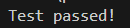
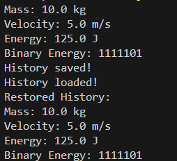
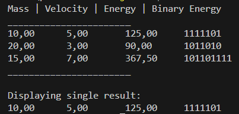

# Завдання 1
## Написати просту консольну програму (наприклад вивід на екран аргументів командної строки)
## Результат

# Завдання 2
## 2.2 Загальне завдання
## Розробити клас, що серіалізується, для зберігання параметрів і результатів обчислень.
## Використовуючи агрегування, розробити клас для знаходження рішення задачі.
## Розробити клас для демонстрації в діалоговому режимі збереження та відновлення стану об'єкта, використовуючи серіалізацію. Показати особливості використання transient полів.
## Розробити клас для тестування коректності результатів обчислень та серіалізації/десеріалізації.
## Використовувати докладні коментарі для автоматичної генерації документації засобами javadoc.
# Індивідуальне завдання
## Знайти двійкове уявлення цілої частини значення кінетичної енергії фізичного тіла при заданих значеннях маси та швидкості.
# Результат:
## Проект реалізує обчислення кінетичної енергії тіла за масою та швидкістю, демонструє серіалізацію/десеріалізацію об'єктів та тестує коректність обчислень.

Приклад роботи
Обчислює енергію для маси 10.0 та швидкості 5.0.
Серіалізує результат у файл energy.ser.
Після десеріалізації виводить:
Відновлені масу та швидкість.
Двійкове представлення енергії.

# Завдання 3
## 1. Як основа використовувати вихідний текст проекту попередньої лабораторної роботи. Забезпечити розміщення результатів обчислень уколекції з можливістю збереження/відновлення.
## 2. Використовуючи шаблон проектування Factory Method (Virtual Constructor), розробити ієрархію, що передбачає розширення рахунок додавання нових відображуваних класів.
## 3. Розширити ієрархію інтерфейсом "фабрикованих" об'єктів, що представляє набір методів для відображення результатів обчислень.
## 4. Реалізувати ці методи виведення результатів у текстовому виде.
## 5. Розробити тареалізувати інтерфейс для "фабрикуючого" методу.
# Результат

# Завдання 4
## 1. За основу використовувати вихідний текст проекту попередньої лабораторної роботи Використовуючи шаблон проектування Factory Method (Virtual Constructor), розширити ієрархію похідними класами, реалізують методи для подання результатів у вигляді текстової таблиці. Параметри відображення таблиці мають визначатися користувачем.
## 2. Продемонструвати заміщення (перевизначення, overriding), поєднання (перевантаження, overloading), динамічне призначення методів (Пізнє зв'язування, поліморфізм, dynamic method dispatch).
## 3. Розробити клас для тестування основної функціональності.
# Результат

